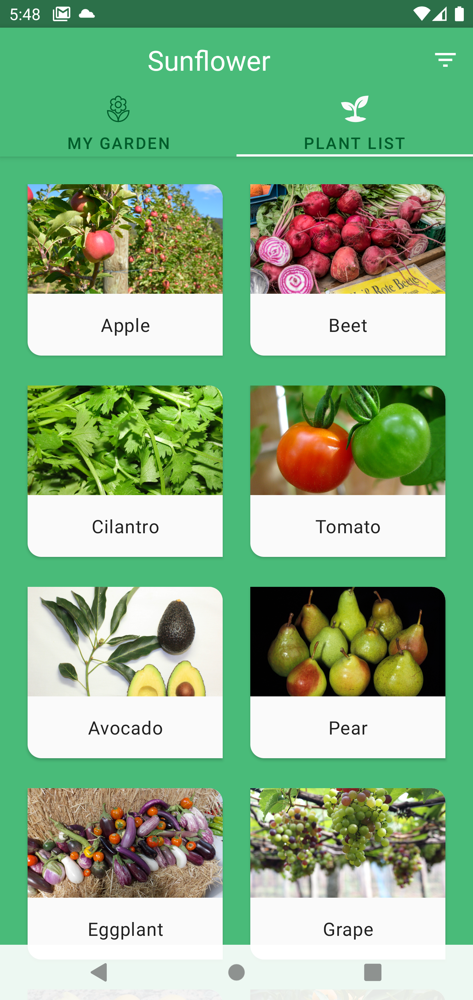

# Android Sunflower with KMM
⚠️ ⚠️ This project is only a sample project to show the KMM project migration tasks. thus it has been omitted tasks for production project such as test code, optimization and logging.⚠️ ⚠️ 

## Result
Android            |  iOS
:-------------------------:|:-------------------------:
  |    
### Migration Targets
- Data Layer
- Domain Layer
- Presentation Layer
  - Only `ViewModel`

### Migration Steps

1. Migrate all android specific dependencies of Targets
   - dagger-hilt => koin
   - room => sql-delight
   - retrofit => ktor

2. Extract `shared` module from `android`
3. Create ios(swift) project and link `shared` module
3. Implement UI using `shared` module
   - `PlantListView` using `PlantListStore`
